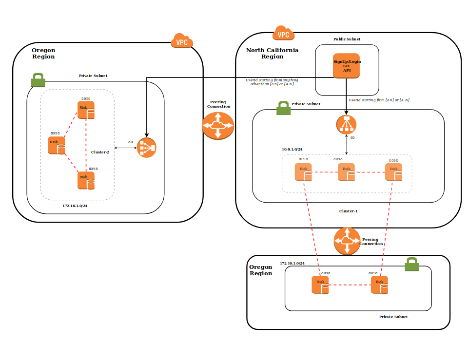
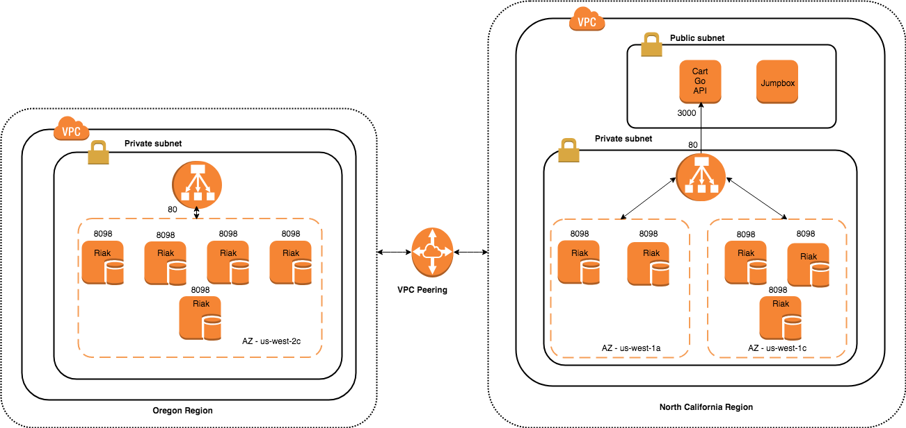
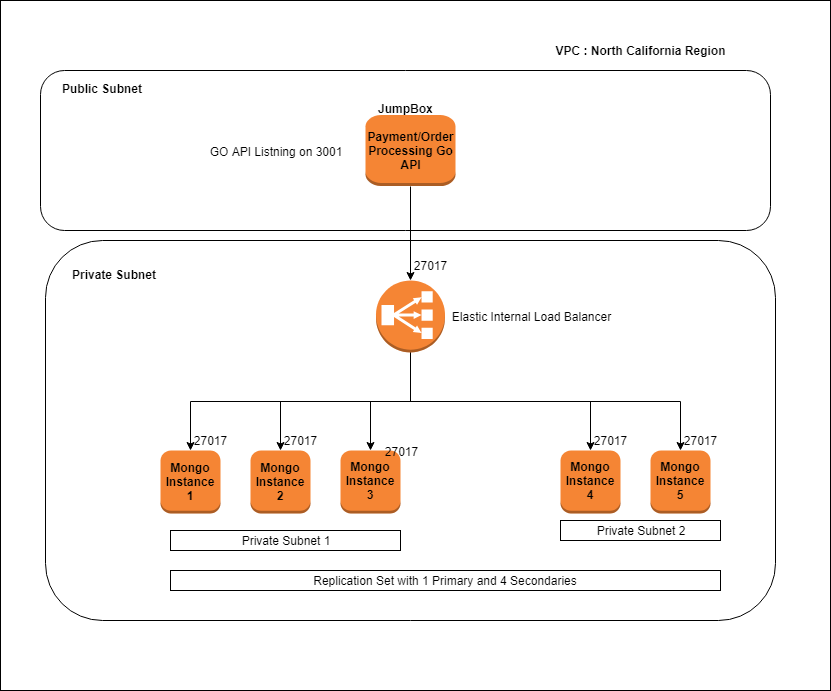

# Project Journal for Coffee with Cloudy Spartans

## Week-1 (10-Nov-2018 - 16-Nov-2018)
### Project Kick Off 

  - Decide on Problem Statement
  - Research on best practices
  - Divided the problem statement into different modules
  - Discussed the different tasks in each module 
  - Assigned each module to the respective team member
  - Decided on the Front End Application UI
  - Discussed on the Application architecture
  
### Challenges/Issues faced :
  - Need more research about the integration of individual microservices across multiple VPC's
  - Need to figure out the combination of databases
***
 ## Week-2 (17-Nov-2018 - 23-Nov-2018)

**Divided the application into four Microservices each to be developed by individual team member as follows:**    
 - Sign-up/Login API- Hansraj    
 - Display/Add items in Catalog API- Srinivas    
 - Place Order/Shopping Cart API- Preethi    
 - Order Processing/Payment API- Abhishek       

**Started with the Development of each of the Front End modules.**

**Finalized NOSQL DBs for individual APIs as follows:**    
 - Sign-up/Login API- Riak     
 - Display/Add items in Catalog API- Mongo    
 - Place Order/Shopping Cart API- Riak    
 - Order Processing/Payment API- Mongo    
 
**Means of Communication between APIs/Databases:**   
- Every API will reside on an instance in public subnet which in turn is able to communicate internally with the Private NOSQL Database instances of the same VPC.  

**Test Scenarios:**  
- Test Scenario 1: Communication between Cart API and Order Processing API to map the number of orders to process.
- Test Scenario 2:  Communicate the status of Order Processing from Order Processing API to Cart API in order to delete the cart.
- Test Scenario 3: Communication between the FrontEnd and Cart API to create/update order.
- Test Scenario 4: Communication between the FrontEnd and Catalog API to add/update items in catalog.
- Test Scenario 5: Communication between the FrontEnd and SignUp to Create/Validate a User.
- Test Scenario 6: Authorising an admin user from Login API to FrontEnd application for adding/editing an item in the catalog.

***
## Week-3 (24-Nov-2018 - 30-Nov-2018)

**Signup/Login API - Riak**  
SignUp/Login API deals with creating a new user, authenticating and authorizing the users based on their UserType.

The SignUp module of the API will add a user in bucket 'Users' with key as 'UserId' and value as other User details. A user can be an admin user or a guest user. Only admin user can add/delete items from catalog.
The Login module of the API authenticates the user based on the UserId and Password provided, and also authorizes based on the respective UserType in database.

A POST request will made for a user to sign up.  
Following is the POST body from front end SignUp page:  
```
{
	"Userid":"<unique id>",
	"email": "<email-id>",
	"UserType": "<admin/user>",
	"Password": "<password>"
}
```

A POST request will be made to take in the details provided while login.  
An internal GET request to the Riak database will fetch the corresponding UserId.  
Request body(UserId and password) of the POST request will be compared with the corresponding value of the User fetched from the Riak db for a successful login.  
Following is the POST body for Login request received from front end login page:  
```
{
	"Userid":"<userid>",
	"Password": "<password>"
}
```

**Catalog and Admin API - Mongo**

This particular module deals with the Catalog of the CCS, display of all the drinks with their description. This module also deals with Admin functionalities like Add a new drink to the catalog, Delete a drink from the catalog, Edit drink information in the catalog.

When the user enters his account, he can view the catalog of the store and can add a drink/drinks to the cart. The User can view information about a particular drink and checkout the necessary.

If a particular user is ADMIN, he can perform CRUD operations on the catalog.

Routes : 

		
	CREATE - "POST" : "/addadrink" 
	READ   - "GET" : "/menu" , "GET" : "/drink/{id}"
	UPDATE - "PUT" : "/updatedrink"
	DELETE - "DELETE" : "/delete"

	
<b> /menu </b> :

To fetch the whole catalog from the Database. Displays the drink with Name, Price, Size and Description.

Example : 
```
	       [
		{
		"id": "<Unique ID>",
		"name": "<Name of the Drink>",
		"price": <Price>,
		"size": <Size>,
		"description": <Description>
	        },
   	        {
		"id": "<Unique ID>",
		"name": "<Name of the Drink>",
		"price": <Price>,
		"size": <Size>,
		"description": <Description>
	        }
		]
```
 
<b> /drink/{id} </b> : 

To fetch a particular drink based on the id (bson object).

Example : 
```
	{
	   	"id": "<Unique ID>",
		"name": "<Name of the Drink>",
		"price": <Price>,
		"size": <Size>,
		"description": <Description>
	       
	}
```

<b> /addaadrink </b> : 

To Add a new drink to the catalog.
Reqires Admin Authentication, Name, Price, Size and Photo of the drink.

Example : 
```
{
	    "name": "White Chocolate Mocha",
	    "price": 5,
	    "size": "Venti",
	    "description": "Best Drink Ever"
	}
```


**Cart API - Riak**

The Cart module will add multiple orders to the cart, display the items in cart and provide order details for payment processing to Order Processing API.
Once the payment processing is done, the cart will be emptied for the user. Each individual user has their own Bucket in Riak Db with keys as 'product-id' of each unique item and value as product details and the count of the respective items in the cart.

A POST request will be made to create an order. 
First we check if the user has already created an order for the same product or not.
If the order was already created for the same product, then the item count is incremented by 1.
If not, a new key will be generated with count initialized as 1.
Following is the POST body for creating a new order:

	{
	 "userid" : "<user id>",
	 "cartItems" : {
	 	"productid" : "<product id>",
		"name" : "<product name>",
		"price" : <product price>,
		"size" : "<product size>",
		"count" : <count>
	 }
	}


A GET request will be made to retrieve all the items in the cart for a particular user.
If the user has not added any item to the Cart, then an empty cart will be displayed.
Else, we loop through all the keys of a particular user, and the value will be sent to the front end.

A GET request will be made to retrieve the count of items in the cart, when a 'checkout' operation is performed.
If the cart is empty, then a http status 400 is sent to the front end.
Otherwise, the userid and the respective total item count will be sent to the front end.
Following is the response body for the GET request:

	{ 
	  "userid" : "<userid>",
	  "order_count" : <respective count> 
	}

On a sucessful payment, a DELETE request will be received by the API from front end to delete all the items in the cart of a particular user.

**Order Processing API - Mongo**

Order processing/Payment API will fetch the details from cart API and based on the count and price of individual item in cart, the total amount of the order will be generated and sent to the front end. If the amount paid by the user is equal to the generated amount by the API, then the corresponding orders will be processed.    

Order Processing module will receive the values from the cart API and these values will be inserted in the 'OrderProcessing' MongoDb collection.    
For this purpose, a POST request will be made.    
Following is the POST body to insert into collection    

	{ 
	  "userid" : "<userid>",
	  "order_count" : <respective count> 
	}


Furthermore, based on the item count, total amount of the order to be processed will be calculated and stored in MongoDb collection for further processing.    
A GET request will fetch this amount for a particular user from the database to display it on the 'Payment page' in front end.   

For Payment processing, a POST request will be made with the amount provided by User on the 'Payment page'.    

	{ 
	  "userid" : "<userid>",
	  "amount" : <amount paid by user> 
	}


The request body of POST request will be compared against the stored amount for the user in the MongoDb collection.      
If the both the amounts match, payment will be processed successfully otherwise, a http status 400 is sent to the front end.    

***
## Week-4 (01-Dec-2018 - 07-Dec-2018)

### Architecture diagrams:

**1. Signup/Login API architecture**



The SignUp/Login GO API takes a json input from the front end application, which is then forwarded to the internal ELBs based on the UserID. If the UserId starts from anything between [a-n] or [A-N], then the request will be forwarded to the internal ELB of North California region or else it will be forwarded to ELB of Oregon Region. 
The two nodes of the North California cluster which are in private subnet of VPC in Oregon region are connected via peering connection, they'll receive all the data inserted in any of the nodes from North California Region.
VPCs from both the regions are connected via peering connection.

**2. Catalog/Admin API-DB architecture**


**3. Cart API Architecture**



The Cart API receives the input json from catalog API, and forwards it to the ELB based on the userid. If the UserId starts with any characters between [a-n] or [A-N], the requests will be routed to the ELB in California region otherwise the requests will go to Oregon region. At any point of time, the Cart will show all the unprocessed items. If the user has not added into the cart, then the cart will be empty. At any point of time, a user can increment/decrement the count of an item in the cart. Since the clusters in two different VPCs of different regions, the API is able to communicate with the clusters because of the VPC peering connection.

**4. Order Processing/Payment API Architecture**    




### Test Cases implementation:
**Test Scenario 1:**   
Communication between Cart API and Order Processing API to map the number of orders to process.  
**Test Result:**  
The count is successfully received by Processing API from Cart API through front end.

**Test Scenario 2:**   
Communicate the status of Order Processing from Order Processing API to Cart API in order to delete the cart.  
**Test Result:**  
On successful paymet, HttpStatusOk response is sent to the Cart API via back end to empty the cart.

**Test Scenario 3:**    
Communication between the FrontEnd and Cart API to create/update order.  
**Test Result:**  
Based on the actions performed by user, new items are added/updated from the cart.

**Test Scenario 4:**  
Communication between the FrontEnd and Catalog API to add/update items in catalog.  
**Test Result:**
Based on the UserType, if an user is an admin, the user will be able to add/update items in catalog.

**Test Scenario 5:**   
Communication between the FrontEnd and SignUp to Create/Validate a User.  
**Test Result:**  
Based on the input provided from the front end Sign Up page, a user will be registered. 
Login page validates a user based on the input provided from front end and the values present in the database.  

**Test Scenario 6:**  
Authorising an admin user from Login API to FrontEnd application for adding/editing an item in the catalog.  
**Test Result:**  
If the user is an admin user, he/she is able to add/update items in the catalog. 


