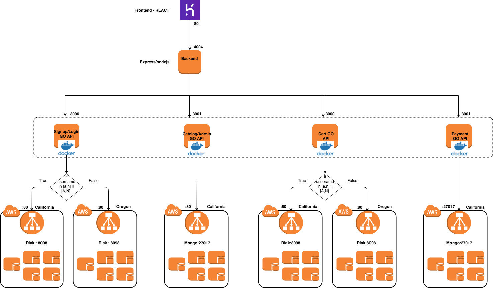

# Micro_service_based_REST_application

## Problem Statement
We are creating **'CCS - Coffee with Cloudy Spartans'** online application.

Following are the core services in our application:
### 1. Login/Sign-up Service
A user will be able to sign-up and login using this service.

### 2. Catalog services
Items available will be displayed on the website.
Additionally maintenance of items within the catalog will be performed by users with admin privileges.

### 3. Shopping cart service
A user will be able to add/remove items to the cart only when the user logs in.

### 4. Order processing service
Items present in the shopping cart can be processed.

